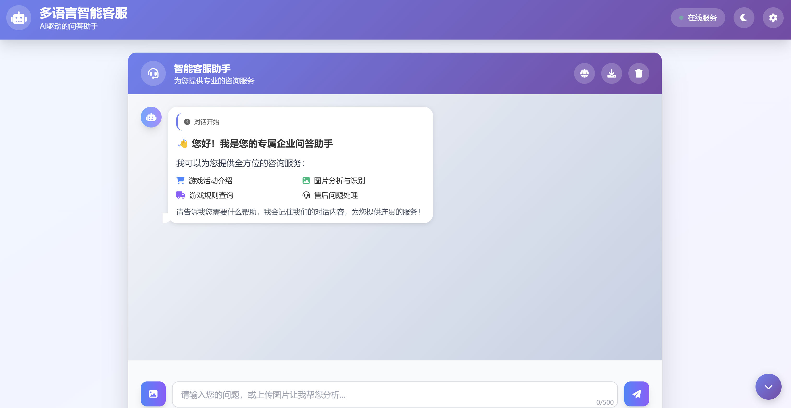
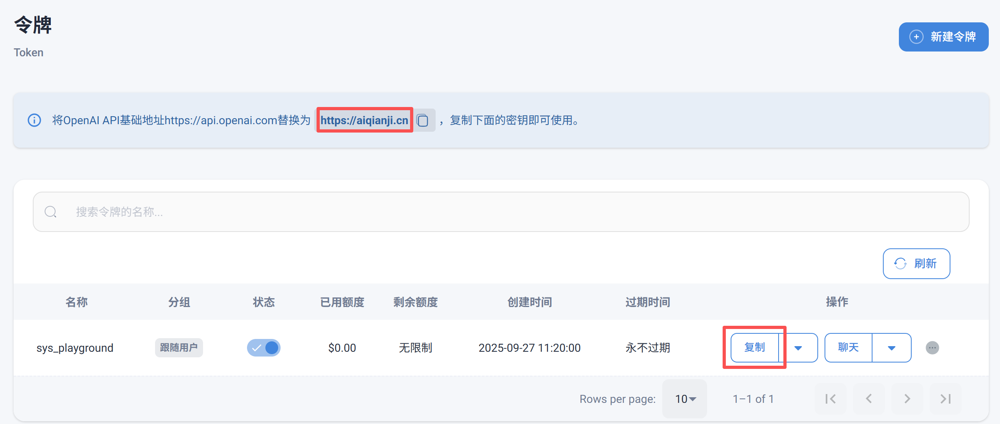
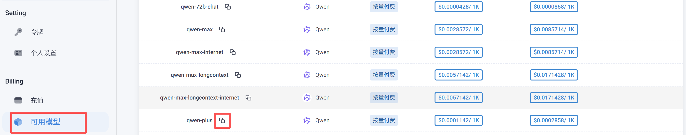

# 多语言智能客服系统

一个基于AI的多语言智能客服系统，支持文字和图片输入，具备知识库管理和垂类提示词功能。


## 功能特点

### 🤖 智能对话
- 支持文字和图片输入
- 基于OpenAI GPT模型的智能回复
- 多模态AI处理（文字+图片）
- 实时对话体验

### 📚 知识库管理
- 内置企业FAQ知识库
- 商品分类知识库
- 向量化搜索
- 支持自定义知识添加
- 外部知识库导入

### 🎯 垂类提示词
- 专业的电商客服提示词系统
- 针对不同问题类型的专门处理
- 退款售后、物流查询、价格优惠等场景优化

### 🌐 Web界面
- 现代化的响应式设计
- 实时聊天界面
- 图片上传和预览
- 快速问题按钮
- 移动端友好

## 项目结构

```
ai_customer/
├── api/
│   └── main.py                 # FastAPI主应用
├── knowledge_base/
│   ├── product_faq.json        # FAQ知识库
│   └── product_categories.json # 商品分类知识库
├── prompts/
│   └── chinese_prompts.py      # 垂类提示词系统
├── services/
│   ├── ai_service.py          # AI服务类
│   └── knowledge_base.py      # 知识库管理
├── templates/
│   └── index.html             # Web界面模板
├── config.py                  # 配置文件
├── requirements.txt           # 依赖包
├── main.py                    # 原始文件
└── README.md                  # 项目说明
```

## 代码文件功能说明

### 🚀 启动脚本

#### `run.py` - 完整启动脚本
- **功能**：系统的主要启动脚本
- **特点**：预加载AI模型和知识库，提供完整功能
- **使用**：`python run.py`
- **适用场景**：生产环境，需要完整AI功能

#### `quick_start.py` - 快速启动脚本
- **功能**：快速启动Web服务器，跳过AI模型预加载
- **特点**：启动速度快，AI功能在后台加载
- **使用**：`python quick_start.py`
- **适用场景**：快速测试，查看界面

#### `simple_main.py` - 简单启动脚本
- **功能**：最小化功能启动
- **特点**：基础Web服务器，适合开发调试
- **使用**：`python simple_main.py`
- **适用场景**：开发和测试

#### `main.py` - 原始启动文件
- **功能**：项目的原始启动文件
- **特点**：基础功能，已过时
- **使用**：不推荐使用

#### `main_with_ai.py` - AI功能启动脚本
- **功能**：包含AI功能的启动脚本
- **特点**：集成AI服务，功能较完整
- **使用**：`python main_with_ai.py`
- **适用场景**：需要AI功能但不想使用完整启动

### 🔧 配置和工具

#### `config.py` - 主配置文件
- **功能**：系统核心配置
- **包含**：API密钥、模型设置、系统参数
- **重要配置**：
  - AI千集API设置
  - 模型参数
  - 知识库路径

#### `requirements.txt` - 依赖包列表
- **功能**：Python依赖包清单
- **包含**：所有必需的第三方库
- **安装**：`pip install -r requirements.txt`

#### `env_example.txt` - 环境变量示例
- **功能**：环境变量配置模板
- **包含**：API密钥等敏感信息模板
- **使用**：复制为 `.env` 文件并填入实际值

### 🤖 AI和模型相关

#### `download_model.py` - 模型下载脚本
- **功能**：下载AI模型到本地
- **特点**：支持断点续传，进度显示
- **使用**：`python download_model.py`
- **下载内容**：文本向量化模型（470MB）

#### `preload_models.py` - 模型预加载脚本
- **功能**：预加载AI模型和知识库
- **特点**：提前加载，减少启动时间
- **使用**：`python preload_models.py`
- **效果**：后续启动更快

#### `check_model.py` - 模型状态检查
- **功能**：检查AI模型下载和加载状态
- **特点**：快速诊断模型问题
- **使用**：`python check_model.py`
- **输出**：模型文件完整性报告

### 🛠️ 安装和维护

#### `install.py` - 安装脚本
- **功能**：自动安装依赖和配置环境
- **特点**：一键安装，自动检查
- **使用**：`python install.py`
- **包含**：依赖检查、环境配置、测试运行

#### `demo.py` - 演示脚本
- **功能**：系统功能演示
- **特点**：展示各种功能特性
- **使用**：`python demo.py`
- **内容**：聊天、图片分析、知识库查询演示

### 📁 核心服务模块

#### `api/main.py` - FastAPI主应用
- **功能**：Web API服务器
- **特点**：RESTful API，WebSocket支持
- **主要接口**：
  - `POST /api/chat` - 聊天接口
  - `GET /api/health` - 健康检查
  - `POST /api/knowledge/add` - 添加知识
  - `GET /api/knowledge/search` - 搜索知识库

#### `services/ai_service.py` - AI服务核心
- **功能**：AI对话和图片分析服务
- **特点**：多模态AI处理
- **主要功能**：
  - 文字对话处理
  - 图片分析
  - 对话历史管理
  - 知识库集成

#### `services/knowledge_base.py` - 知识库管理
- **功能**：知识库加载和搜索
- **特点**：向量化搜索，关键词匹配
- **主要功能**：
  - 知识库加载
  - 向量化索引构建
  - 相似度搜索
  - 知识添加和管理

#### `prompts/chinese_prompts.py` - 提示词系统
- **功能**：电商客服专用提示词
- **特点**：垂类优化，场景化提示
- **包含**：
  - 系统提示词
  - 文字对话提示词
  - 图片分析提示词
  - 不同场景的专门提示词

### 📚 知识库数据

#### `knowledge_base/product_faq.json` - FAQ知识库
- **功能**：常见问题解答数据库
- **内容**：60个常见问题及答案
- **分类**：退款、物流、售后、账户等
- **格式**：JSON格式，结构化数据

#### `knowledge_base/product_categories.json` - 商品分类知识库
- **功能**：商品分类和相关信息
- **内容**：10个主要商品分类
- **包含**：分类信息、关键词、常见问题
- **用途**：商品相关咨询支持

### 🎨 前端界面

#### `templates/index.html` - Web界面模板
- **功能**：主要的Web用户界面
- **特点**：响应式设计，现代化UI
- **功能**：
  - 聊天界面
  - 图片上传
  - 快速问题按钮
  - 移动端适配

#### `static/` - 静态资源目录
- **功能**：CSS、JS、图片等静态文件
- **内容**：样式文件、脚本文件、图标等

### 📋 文档和说明

#### `README.md` - 项目说明文档
- **功能**：项目主要文档
- **内容**：安装、配置、使用说明

#### `启动指南.md` - 启动指南
- **功能**：详细的启动说明
- **内容**：不同启动方式、故障排除

#### `功能改进总结.md` - 功能改进记录
- **功能**：功能改进历史
- **内容**：版本更新、功能增强记录

#### `问题修复总结.md` - 问题修复记录
- **功能**：问题修复历史
- **内容**：Bug修复、问题解决方案

#### `预加载功能说明.md` - 预加载功能文档
- **功能**：预加载功能详细说明
- **内容**：预加载原理、使用方法

## 安装和运行

### 1. 环境准备

确保您已安装Python 3.8+，然后创建虚拟环境：

```bash
python -m venv .venv
source .venv/bin/activate  # Linux/Mac
# 或
.venv\Scripts\activate     # Windows
```

### 2. 安装依赖

```bash
pip install -r requirements.txt
```

### 3. 配置API密钥

创建 `.env` 文件并添加您的大模型密钥。

大模型密钥的获取地址：https://aiqianji.cn

申请APIKEY:


选择可用模型：


```env
AIQIANJI_API_KEY=your_AIQIANJI_API_KEY_here
AIQIANJI_BASE_URL=https://aiqianji.cn/v1
TEXT_MODEL=qwen-plus
VISION_MODEL=qwen2.5-vl-72b-instruct
```

### 4. 下载AI模型到本地（重要！）

**为什么需要下载模型？**
- 🚀 **更快的启动速度**：避免每次启动时从网络下载模型
- 🔒 **离线可用**：网络不稳定时仍可正常使用
- 💾 **节省流量**：模型文件约470MB，下载一次即可重复使用
- ⚡ **更好的性能**：本地加载比网络下载快很多

**模型下载步骤：**

```bash
# 方法1：使用专门的下载脚本
python download_model.py

# 方法2：手动下载（首次运行时会自动下载）
python test_model_loading.py
```

**模型文件信息：**
- 📦 **模型名称**：`paraphrase-multilingual-MiniLM-L12-v2`
- 📁 **存储位置**：`~/.cache/huggingface/hub/`
- 💾 **文件大小**：约470MB
- 🎯 **用途**：文本向量化，用于知识库搜索

**下载状态检查：**
```bash
# 检查模型是否已下载
python check_model.py
```

### 5. 预加载模型（推荐）

在首次运行前，建议先预加载模型和知识库：

```bash
python preload_models.py
```

这将预加载所有必要的模型和知识库，提供更快的响应速度。

### 6. 运行应用

**完整启动模式（推荐）：**
```bash
python run.py
```

**快速启动模式：**
```bash
python quick_start.py
```

**简单启动模式：**
```bash
python simple_main.py
```

或者直接使用uvicorn：

```bash
uvicorn api.main:app --host 0.0.0.0 --port 8000 --reload
```

### 7. 访问应用

打开浏览器访问：http://localhost:8000

## 模型管理

### 本地模型优势

| 特性 | 本地模型 | 网络下载 |
|------|----------|----------|
| 启动速度 | ⚡ 快（秒级） | 🐌 慢（分钟级） |
| 网络依赖 | ❌ 无 | ✅ 需要 |
| 稳定性 | 🛡️ 高 | ⚠️ 受网络影响 |
| 重复使用 | ✅ 是 | ❌ 每次重新下载 |

### 模型文件位置

**Windows:**
```
C:\Users\[用户名]\.cache\huggingface\hub\models--sentence-transformers--paraphrase-multilingual-MiniLM-L12-v2\
```

**Linux/Mac:**
```
~/.cache/huggingface/hub/models--sentence-transformers--paraphrase-multilingual-MiniLM-L12-v2/
```

### 模型文件说明

- `model.safetensors` - 主要模型文件（470MB）
- `config.json` - 模型配置文件
- `tokenizer.json` - 分词器文件
- `special_tokens_map.json` - 特殊标记映射

### 故障排除

**如果模型下载失败：**
1. 检查网络连接
2. 确保可以访问 huggingface.co
3. 尝试使用VPN
4. 手动下载模型文件
5. 设置国内镜像

**windows**
```
$env:HF_ENDPOINT="https://hf-mirror.com"
```

**linux**
```
export HF_ENDPOINT="https://hf-mirror.com"
```

**如果模型加载失败：**
1. 检查模型文件是否完整
2. 运行 `python check_model.py` 诊断
3. 删除损坏的缓存文件重新下载

## 预加载功能

### 为什么需要预加载？

- **更快的响应速度**：模型在启动时就加载完成，用户提问时无需等待
- **更好的用户体验**：避免首次请求时的延迟
- **系统稳定性**：提前发现和解决模型加载问题

### 预加载内容

- 🤖 AI服务初始化
- 📚 知识库加载和向量化
- 🔍 搜索索引构建
- 🔧 API客户端配置

### 预加载时间

- 首次预加载：约30-60秒（取决于网络和硬件）
- 后续预加载：约5-15秒（模型已缓存）

## 使用说明

### 基本对话
1. 在输入框中输入您的问题
2. 点击发送按钮或按回车键
3. AI助手会根据知识库内容给出专业回答

### 图片分析
1. 点击图片上传按钮
2. 选择要分析的图片
3. 输入相关问题
4. AI会分析图片内容并给出建议

### 快速问题
点击页面底部的常见问题按钮，快速获取答案

## 知识库说明

### 内置知识库
- **FAQ知识库**：包含退款、物流、售后等常见问题
- **商品分类知识库**：服装、数码、美妆、食品等分类信息

### 自定义知识
可以通过API添加自定义知识：

```bash
curl -X POST "http://localhost:8000/api/knowledge/add" \
  -F "question=您的问题" \
  -F "answer=标准答案" \
  -F "category=分类"
```

## API接口

### 聊天接口
- `POST /api/chat` - 处理文字和图片聊天

### 知识库接口
- `POST /api/knowledge/add` - 添加知识
- `GET /api/knowledge/search` - 搜索知识库

### 健康检查
- `GET /api/health` - 服务状态检查

## 技术栈

- **后端框架**：FastAPI
- **AI模型**：OpenAI GPT-3.5/GPT-4
- **向量数据库**：FAISS
- **文本嵌入**：Sentence Transformers
- **前端**：HTML + Tailwind CSS + JavaScript
- **图片处理**：Pillow

## 配置选项

在 `config.py` 中可以调整以下配置：

- OpenAI API设置
- 模型参数
- 知识库路径
- 图片处理参数
- 系统配置

## 扩展功能

### 添加新的知识库
1. 在 `knowledge_base/` 目录下添加JSON文件
2. 在 `KnowledgeBase` 类中添加处理方法
3. 重新加载知识库

### 自定义提示词
在 `prompts/chinese_prompts.py` 中添加新的提示词模板

## 开发指南

### 代码结构说明

#### 核心模块
- **API层** (`api/`)：Web接口和路由
- **服务层** (`services/`)：业务逻辑和AI服务
- **数据层** (`knowledge_base/`)：知识库数据
- **配置层** (`config.py`)：系统配置

#### 启动脚本
- **生产环境**：使用 `run.py`
- **开发调试**：使用 `simple_main.py`
- **快速测试**：使用 `quick_start.py`

#### 工具脚本
- **模型管理**：`download_model.py`, `check_model.py`
- **环境配置**：`install.py`, `config.py`
- **功能演示**：`demo.py`

### 开发建议

1. **使用虚拟环境**：避免依赖冲突
2. **先下载模型**：确保AI功能可用
3. **使用开发模式**：`python simple_main.py` 进行调试
4. **查看日志**：关注控制台输出信息
5. **测试API**：使用 `/docs` 页面测试接口

### 常见开发任务

#### 添加新功能
1. 在 `services/` 中添加业务逻辑
2. 在 `api/main.py` 中添加API接口
3. 在 `templates/` 中更新前端界面
4. 更新文档说明

#### 修改配置
1. 编辑 `config.py` 文件
2. 重启服务使配置生效
3. 测试功能是否正常

#### 调试问题
1. 查看控制台错误信息
2. 使用 `check_model.py` 检查模型状态
3. 检查网络连接和API配置
4. 查看相关日志文件