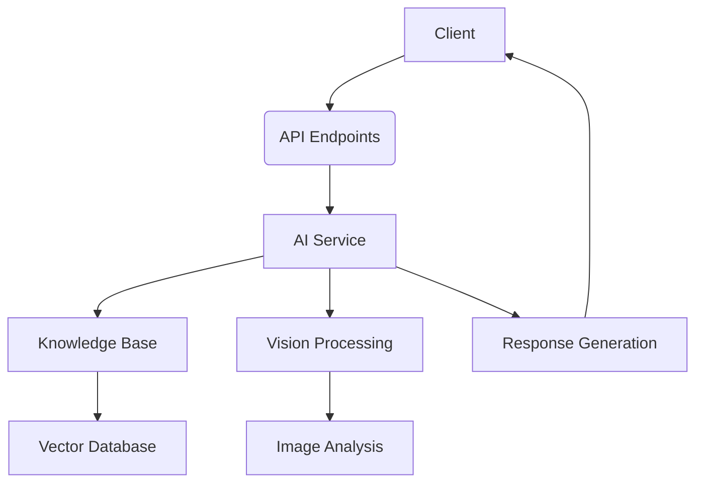

# FastAPI Documentation: Enterprise Intelligent Customer Service

## Overview
The Enterprise Intelligent Customer Service system provides AI-powered customer support with text and image processing capabilities. The API supports multi-language responses and integrates with a knowledge base for enhanced responses.

**Base URL**: `http://localhost:8000`

## Authentication
No authentication required for most endpoints. All API endpoints are open.

## Endpoints

### 1. Homepage
- **GET** `/`
- Returns: HTML homepage
- Description: Main application interface

### 2. Health Check
- **GET** `/api/health`
- Returns:
  ```json
  {
    "status": "healthy",
    "service": "多语言智能客服"
  }
  ```
- Description: Service health status

### 3. Chat Endpoint
- **POST** `/api/chat`
- Handles customer queries with optional image upload
- Parameters (form-data):
  - `message`: Customer query text
  - `image`: Optional image file (JPG/PNG/GIF, max 1MB)
  - `language`: Response language (`zh`, `en`, `hi`)
  - `user_info`: Optional user metadata

- Response:
  ```json
  {
    "success": true,
    "answer": "Response text",
    "knowledge_context": "Relevant knowledge context",
    "model_used": "model-name",
    "conversation_length": 5
  }
  ```

- Error Response (400):
  ```json
  {"detail": "只支持图片文件"}
  ```

- Error Response (500):
  ```json
  {"detail": "AI服务未初始化"}
  ```

### 4. Knowledge Management

#### Add Knowledge
- **POST** `/api/knowledge/add`
- Adds new Q&A to knowledge base
- Parameters:
  - `question`: Question text
  - `answer`: Answer text
  - `category`: Knowledge category

- Response:
  ```json
  {"status": "success", "message": "知识添加成功"}
  ```

#### Search Knowledge
- **GET** `/api/knowledge/search`
- Searches knowledge base
- Parameters:
  - `query`: Search query
  - `top_k`: Number of results (default: 5)

- Response:
  ```json
  [
    {
      "question": "退货流程",
      "answer": "1. 登录账户 2. 进入订单页面...",
      "score": 0.92
    }
  ]
  ```

#### Clear Chat History
- **POST** `/api/chat/clear`
- Clears conversation history
- Response:
  ```json
  {"status": "success", "message": "对话历史已清空"}
  ```

## Models and Configuration

### AI Models
- Text Model: `ep-20250630154739-xfq88`
- Vision Model: `ep-20250630154739-xfq88`
- Embedding Model: `text-embedding-ada-002`

### Configuration (`config.py`)
```python
class Config:
    # API
    AIQIANJI_API_KEY = "54a1f115-381d-4c38-86ab-e43bee3bbb83"
    AIQIANJI_BASE_URL = "https://api.modelarts-maas.com/v1"

    # Knowledge Base
    KNOWLEDGE_BASE_PATH = "knowledge_base"
    VECTOR_DB_PATH = "vector_db"

    # Image Processing
    MAX_IMAGE_SIZE = 1024 * 1024  # 1MB
    SUPPORTED_IMAGE_FORMATS = ['.jpg', '.jpeg', '.png', '.gif', '.bmp']

    # System
    MAX_TOKENS = 2000
    TEMPERATURE = 0.7
```

## Startup and Execution
To start the service:
```bash
python run.py
```

The service will:
1. Preload AI models and knowledge base
2. Start web server on port 8000
3. Open browser to `http://localhost:8000`

## Error Codes
| Code | Meaning               | Description                          |
|------|-----------------------|--------------------------------------|
| 400  | Bad Request           | Invalid parameters or file format    |
| 500  | Internal Server Error | AI service initialization failure    |

## Sample Requests

### Text Chat Request
```bash
curl -X POST http://localhost:8000/api/chat \
  -F "message=如何办理退货？" \
  -F "language=zh"
```

### Image Analysis Request
```bash
curl -X POST http://localhost:8000/api/chat \
  -F "message=这个产品是什么？" \
  -F "image=@product.jpg" \
  -F "language=zh"
```

## Architecture

